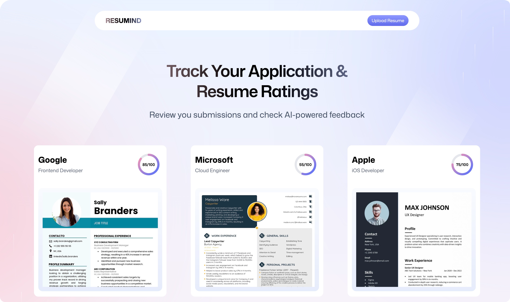

<div align="center">
  <br />
    
  <br />
  <div>

 


  </div>

  <h3 align="center">Resumind - AI Resume Analyzer</h3>

  <div align="center">
    An intelligent resume analysis platform powered by AI that provides comprehensive ATS scores, detailed feedback, and actionable improvement suggestions to help job seekers optimize their resumes for better job application success.
  </div>
</div>

## 📋 <a name="table">Table of Contents</a>

1. ✨ [Introduction](#introduction)
2. ⚙️ [Tech Stack](#tech-stack)
3. 🔋 [Features](#features)
4. 🤸 [Quick Start](#quick-start)

## <a name="introduction">✨ Introduction</a>

Resumind is a modern web application that leverages artificial intelligence to analyze resumes and provide comprehensive feedback. Built with React and powered by advanced AI models, it helps job seekers understand how their resumes perform against Applicant Tracking Systems (ATS) and provides detailed insights across multiple dimensions including ATS compatibility, tone and style, content quality, structure, and skills alignment.

Users can upload their PDF resumes, specify job details, and receive instant AI-powered analysis with scores, tips, and explanations. The platform tracks all analyzed resumes, allowing users to review their application history and monitor improvements over time.

## <a name="tech-stack">⚙️ Tech Stack</a>

- **[React](https://react.dev/)** – Modern UI library for building interactive, component-based user interfaces with React 19.

- **[React Router v7](https://reactrouter.com/)** – Full-stack routing framework with server-side rendering, data loading, and optimized production builds.

- **[TypeScript](https://www.typescriptlang.org/)** – Type-safe JavaScript for better developer experience and code reliability.

- **[Vite](https://vitejs.dev/guide/)** – Lightning-fast development server with Hot Module Replacement (HMR) and optimized production builds.

- **[TailwindCSS](https://tailwindcss.com/)** – Utility-first CSS framework for rapid UI development with responsive design and modern styling.

- **[Zustand](https://zustand-demo.pmnd.rs/)** – Lightweight state management library for managing global application state including authentication and cloud service connections.

- **[PDF.js](https://mozilla.github.io/pdf.js/)** – Mozilla's PDF rendering library for converting PDF resumes to images for AI analysis.

- **[Puter.js](https://puter.com/)** – Cloud platform providing file storage, AI services, and authentication infrastructure.

## <a name="features">🔋 Features</a>

👉 **AI-Powered Resume Analysis**: Get comprehensive feedback powered by advanced AI models (GPT-4o-mini/GPT-4o) with intelligent fallback mechanisms.

👉 **ATS Score Evaluation**: Receive detailed ATS compatibility scores to understand how well your resume performs with applicant tracking systems.

👉 **Multi-Dimensional Feedback**: Analyze resumes across five key areas including ATS compatibility, tone and style, content quality, structure, and skills alignment with detailed tips and explanations for each category.

👉 **PDF to Image Conversion**: Seamless conversion of PDF resumes to high-quality images for AI processing using PDF.js.

👉 **Resume Tracking Dashboard**: View all analyzed resumes in one place with quick access to scores and company/job information.

👉 **Detailed Review Pages**: Interactive review interface with side-by-side resume preview and comprehensive feedback breakdown.

👉 **Cloud Storage Integration**: Secure file storage and retrieval using Puter.js cloud infrastructure.

👉 **Authentication System**: Secure user authentication and session management.

👉 **Responsive Design**: Fully responsive UI that works seamlessly across desktop, tablet, and mobile devices.

👉 **Real-time Processing Status**: Visual feedback during upload, conversion, and analysis stages.

## <a name="quick-start">🤸 Quick Start</a>

Follow these steps to set up the project locally.

### Prerequisites

Make sure you have the following installed:

- [Git](https://git-scm.com/)
- [Node.js](https://nodejs.org/en) (v18 or higher recommended)
- [npm](https://www.npmjs.com/) (Node Package Manager)

### Cloning the Repository

```bash
git clone https://github.com/mahendratanjung/ai-resume-analyzer.git
cd ai-resume-analyzer
```

### Installation

Install the project dependencies using npm:

```bash
npm install
```

### Running the Project

Start the development server:

```bash
npm run dev
```

Open [http://localhost:5173](http://localhost:5173) in your browser to view the project.
